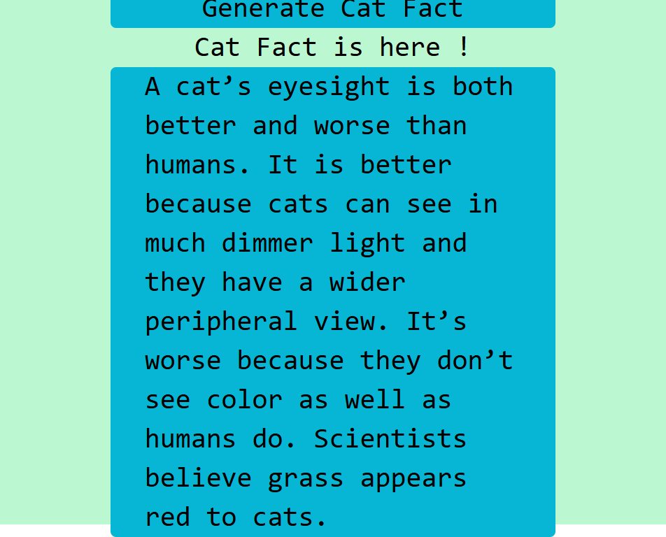
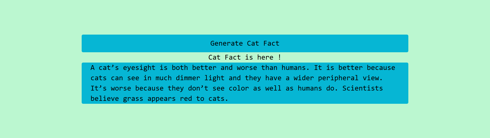

# Project Cat FACT
## It is a simple web app for finding cat fact 
## In this app get data from api " catfact.ninja " 
## Features
## Axios for API Requests: Axios is used to make HTTP requests to external APIs. It simplifies the process of fetching, posting, updating, and deleting data with built-in support for promises and error handling.

## Async/Await Syntax: This app uses async/await for handling asynchronous operations in a more readable and maintainable way. It allows for writing asynchronous code that looks and behaves like synchronous code.
ds
## In big screen

## In small screen
